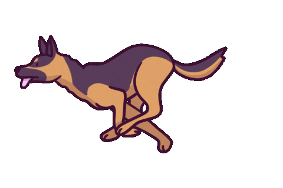

<h1 align="center">
  
</h1>

  

🌱 I’m currently working on: **an AI platform for Engineers**

📝 I'm currently learning **Go, AI, TypeScript**

💬 Ask me about: **AWS, Terraform, Kubernetes, Go, or System Architecture**

⚡ Fun fact: **I have a German Shepherd named Maverick!**

<h3 align="left">Connect with me:</h3>

<h2 align="center"> ⚒️ Tools & Languages ⚒️</h2>
 

    
     
     

 

  <h2>🐍 My Contributions 🐍</h2>
   
  
  <picture>
  <source media="(prefers-color-scheme: dark)" srcset="github-snake-dark.svg" />
  <source media="(prefers-color-scheme: light)" srcset="github-snake.svg" />
  
  </picture>
     

<h2 align="center">⚡ Stats ⚡</h2>
 

  </a>
  
  

  

